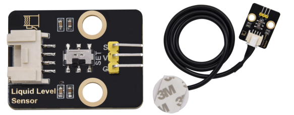
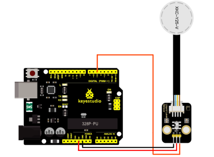

# KS0346 Keyestudio Non-contact Liquid Level Sensor(Black and Friendly)



## 1. Description

This is a non-contact liquid level sensor can detect the liquid height in the closed container, overcoming the problem of thick container walls.

Its working principle is to use the water sensing capacitor to detect whether liquid is present. In the absence of liquid near the sensor, there will be a presence of distributed capacitance, and therefore there are some certain static capacitance to ground on the sensor. If the liquid is close to the sensor, the final capacitance of the sensor grows bigger. Then the changeable capacitance will be converted into some signal’s variation.

Then, a certain algorithm will detect and determine how much this variation is. When a certain threshold value is exceeded, the liquid level is considered to reach the induction point.

Equipped with a XH2.54 conversion board, the signals can be controlled by sliding switch. Slide to SET end, the level is high; on the contrary, the level is low.

It can be interfaced with Arduino and other controllers, therefore, digital signals can be collected directly.

## 2. Specification

- Working voltage: 3.3-9V (DC)
- Output voltage: high level 3.3V-9V, low level 0V
- Output current; 1.2-3.5mA
- Interface: 3PIN interface
- Weight: 23.3g

## 3. Connection Diagram



## 4. Test Code

```c
int Liquid_level = 0;

void setup() 
{
  Serial.begin(9600);
  pinMode(5, INPUT);
}

void loop() 
{
  Liquid_level = digitalRead(5);
  Serial.print("Liquid_level= "); Serial.println(Liquid_level, DEC);
  delay(500);
}
```

## 5. Test Result

Upload the test code and stick the XKC-Y25 on the container. When the liquid level is detected, the OUT pin will output high levels and the indicator of the sensor will light up; on the contrary, low levels will be output and the indicator will go off.